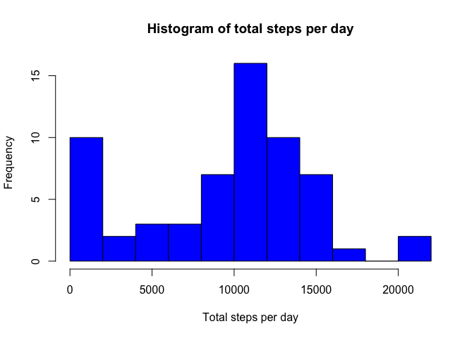
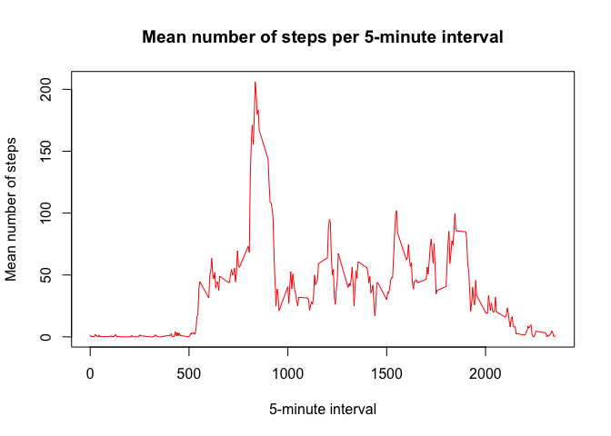
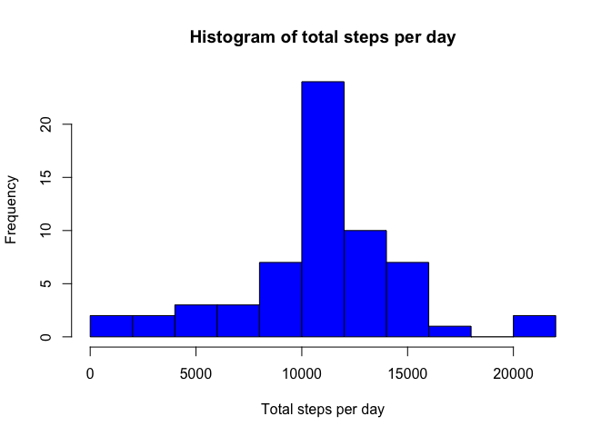
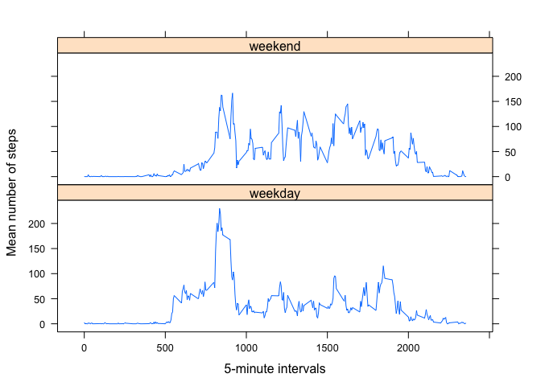

# Reproducible Research: Peer Assessment 1


## Loading and preprocessing the data  
The following loads the activity data and mildly processes it so that dates are indeed date data types.


```r
activity <- read.csv("activity.csv")
activity <- transform(activity, date = as.Date(date))
```


## What is mean total number of steps taken per day?  

The following adds up the total number of steps taken per day, displays a histogram for the total steps, and then calculates the mean and median number of steps.


```r
totalsteps <- tapply(activity$steps, activity$date, sum, na.rm = TRUE)
hist(totalsteps, 
     xlab = "Total steps per day", 
     main = "Histogram of total steps per day", 
     col = "blue", 
     breaks = 10)
```

<!-- -->

```r
mean(totalsteps)
```

```
## [1] 9354.23
```

```r
median(totalsteps)
```

```
## [1] 10395
```

## What is the average daily activity pattern?  

The following code constructs a time series plot of mean number of steps per day versus the identifier of the 5-minute interval in which the measurement was taken.  Also, the 5-minute interval in which the maximum mean number of steps occurred is returned.


```r
meansteps <- tapply(activity$steps, activity$interval, mean, na.rm = TRUE)
plot(as.numeric(names(meansteps)),meansteps,
     main = "Mean number of steps per 5-minute interval",
     xlab = "5-minute interval",
     ylab = "Mean number of steps",
     col = "red",
     type = "l")
```

<!-- -->

```r
Max <- max(meansteps)
logical <- meansteps == Max
names(which(logical))
```

```
## [1] "835"
```


## Imputing missing values  

The following code first returns the number of missing values, and then replaces missing values with the mean number of steps per day for the given 5-minute interval.  Observe that the imputed data has a histogram, mean and median that reflects the fact that the missing values serve as a drag on the mean, specifically, since the missing data results in lower sums of total steps per day.


```r
missing <- is.na(activity$steps)
length(which(missing))
```

```
## [1] 2304
```

```r
indices <- which(missing)

activity <- transform(activity, interval = factor(interval))
meansteps <- as.data.frame(meansteps)
intervals <- levels(activity$interval)
meansteps$interval <- intervals

activity.imputed <- activity

for(i in seq_along(indices)){
        x<- indices[i]
        interval <- as.character(activity.imputed[x,3])
        yvec <- meansteps$interval
        for(j in seq_along(yvec)){
                if(interval == meansteps[j,2]){
                        mean <- meansteps[j,1]
                        activity.imputed[x,1] <- mean
                }
        }
}
totalsteps.imputed <- tapply(activity.imputed$steps, 
                             activity.imputed$date, 
                             sum, na.rm = TRUE)
hist(totalsteps.imputed, 
     xlab = "Total steps per day", 
     main = "Histogram of total steps per day", 
     col = "blue", 
     breaks = 10)
```

<!-- -->

```r
mean(totalsteps.imputed)
```

```
## [1] 10766.19
```

```r
median(totalsteps.imputed)
```

```
## [1] 10766.19
```

## Are there differences in activity patterns between weekdays and weekends?  

The following code takes the imputed data, and sorts it into two categories depending on whether the data was collected on a weekend or weekday; a panel time series plot of mean number of steps versus 5-minute interval is then constructed to compare the two categories.


```r
day <- weekdays(activity.imputed$date)
for(i in seq_along(day)){
        if(day[i]=="Saturday"|day[i]=="Sunday"){day[i]<-"weekend"}
        else{day[i]<-"weekday"}
}
day <- as.factor(day)
activity.imputed$day <- day
library(dplyr)
```

```
## 
## Attaching package: 'dplyr'
```

```
## The following objects are masked from 'package:stats':
## 
##     filter, lag
```

```
## The following objects are masked from 'package:base':
## 
##     intersect, setdiff, setequal, union
```

```r
library(lattice)
activity.imputed <- select(activity.imputed, day, interval, steps)
activity.panel <- activity.imputed %>% group_by(interval, day) %>% summarize_each(funs(mean))
activity.panel$interval <- as.numeric(as.character(activity.panel$interval))
xyplot(steps ~ interval | day, 
       data = activity.panel, 
       layout = c(1,2), 
       type = "l", 
       xlab = "5-minute intervals", 
       ylab = "Mean number of steps")
```

<!-- -->
